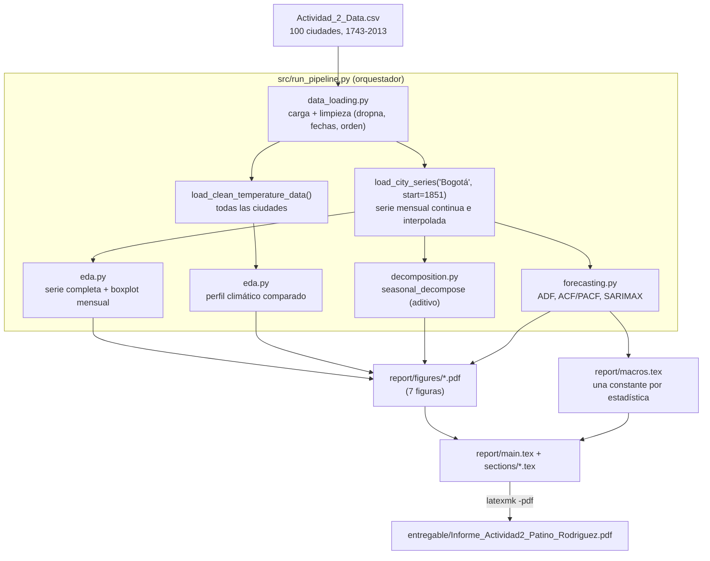
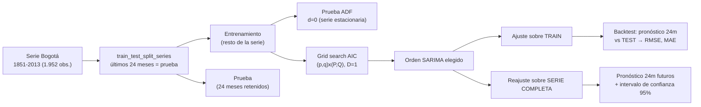

# Actividad 2: Cargando y Visualizando Datos con Python — Series de Tiempo

**Maestría en Inteligencia Artificial**
**Estudiante:** Juan Nicolás Patiño Rodríguez

---

## 🎯 Resumen de la Actividad

Esta entrega resuelve la actividad evaluativa "Problema" de la Unidad 2: un análisis del
histórico de temperatura promedio mensual de 100 ciudades del mundo (dataset derivado de
Berkeley Earth), con foco en Bogotá. El entregable final es un **informe científico en
LaTeX/PDF** que cubre análisis gráfico, descomposición de la serie de tiempo y pronóstico
mediante un modelo SARIMA, siguiendo la rúbrica de la Guía de Actividades UA2.

A diferencia de los Casos 3–5 (notebooks tutoriales con ejercicios guiados sobre TRM/IPC y
precipitaciones, aún pendientes de resolución), este directorio contiene el pipeline de
análisis y el informe correspondientes a la actividad calificada.

---

## 🔀 Flujo de Datos y Arquitectura del Pipeline

Todo el análisis se orquesta con un único comando (`src/run_pipeline.py`), que conecta la
carga de datos con cada etapa del análisis y termina generando los insumos que consume el
informe en LaTeX:



El modelado en particular sigue dos caminos separados a partir del mismo orden SARIMA: uno
de **validación** (backtest contra datos ya observados) y otro de **pronóstico real** hacia
el futuro, reajustando sobre toda la serie disponible:



---

## 🧭 Decisiones de Diseño

### Metodológicas (análisis)

- **Bogotá como ciudad de enfoque**, con Berlín, El Cairo, Bangkok y Ciudad del Cabo como
  referencia comparativa de climas distintos — en vez de analizar las 100 ciudades, para
  cumplir con la profundidad que pide la rúbrica (una serie bien descompuesta y pronosticada)
  en lugar de una cobertura superficial de muchas.
- **Ventana de análisis acotada a 1851–2013**: se detectó un vacío continuo de 20 años en los
  datos de Bogotá (1830–1850, 246 meses sin registro) al inspeccionar la descomposición.
  Interpolar ese tramo habría fabricado tendencia y estacionalidad inexistentes, así que se
  excluyó en vez de rellenarlo (`load_city_series(..., start="1851-01-01")`).
- **Descomposición aditiva, no multiplicativa**: la amplitud del ciclo estacional se mantiene
  estable en el tiempo y no crece con el nivel de la serie, que es el supuesto que justificaría
  un modelo multiplicativo.
- **Orden SARIMA por búsqueda en grilla minimizando AIC**, en vez de elegirlo a mano: `d=0`
  se fija por la prueba ADF (serie ya estacionaria), `D=1` por la fuerte periodicidad anual;
  solo `(p,q)` y `(P,Q)` se exploran automáticamente.
- **Evaluación en dos pasos**: un *backtest* contra 24 meses retenidos (para medir error
  genuino fuera de muestra) y, por separado, un reajuste sobre la serie completa para el
  pronóstico real hacia el futuro — nunca se mezclan ambos usos del modelo.
- **SARIMA (statsmodels) en vez de Prophet/pmdarima**: la rúbrica acepta explícitamente
  "ARIMA, Prophet", y Prophet/pmdarima tienen soporte incierto en Python 3.13 (versión del
  intérprete disponible); statsmodels es la opción robusta y ya validada en este entorno.

### Técnicas (implementación)

- **`report/macros.tex` como única fuente de verdad**: cada cifra citada en el informe (RMSE,
  orden del modelo, p-valor ADF, etc.) se calcula en Python y se expone como comando LaTeX,
  en vez de transcribirse a mano y arriesgar que texto y código diverjan.
- **Notación numérica en convención española** (decimal `,`, miles `.`) tanto en las cifras
  generadas por Python como en el LaTeX (`\num`, `\SI`), consistente con el idioma del informe.
- **Se extendió el repositorio existente de Actividad 1** (`Inmersion_Programacion_Maestria`)
  en vez de crear uno nuevo, para mantener todo el curso versionado en un solo lugar con el
  mismo historial y remoto de GitHub.
- **Entorno virtual (`.venv`) y `requirements.txt` propios de esta actividad**, porque el
  intérprete de Python global no tenía instaladas las librerías necesarias
  (`matplotlib`, `statsmodels`, `scikit-learn`, `mypy`).

---

## 📂 Estructura del Directorio

```text
Actividad_2/
├── requirements.txt          # Dependencias fijadas del entorno (.venv/)
├── pyproject.toml            # Configuracion de mypy --strict
├── data/
│   └── Actividad_2_Data.csv  # Dataset fuente (temperaturas historicas, 100 ciudades)
├── src/                      # Pipeline de analisis, tipado estatico estricto
│   ├── data_loading.py       # Carga, limpieza y series por ciudad
│   ├── eda.py                 # Analisis grafico comparativo (EDA)
│   ├── decomposition.py       # Descomposicion aditiva (tendencia/estacionalidad/residuo)
│   ├── forecasting.py         # ADF, ACF/PACF, seleccion de orden SARIMA, pronostico
│   └── run_pipeline.py        # Orquestador: regenera figuras y report/macros.tex
├── report/                   # Informe cientifico en LaTeX
│   ├── main.tex               # Documento maestro
│   ├── references.bib         # Bibliografia
│   ├── macros.tex              # Resultados numericos (generado por run_pipeline.py)
│   ├── sections/               # Una seccion por archivo (introduccion...conclusiones)
│   ├── figures/                 # Figuras generadas por el pipeline (PDF vectorial)
│   └── main.pdf                 # Informe compilado
└── entregable/
    └── Informe_Actividad2_Patino_Rodriguez.pdf   # PDF final entregable
```

---

## 🌟 Estándares Aplicados

1. **Tipado estático estricto**: todo `src/` pasa `mypy --strict` (configurado en
   `pyproject.toml`), con anotaciones explícitas en funciones, variables y estructuras de
   datos (`dataclass` para resultados de partición train/test, orden SARIMA y pronósticos).
2. **Pipeline reproducible de un solo comando**: `python src/run_pipeline.py` ejecuta de
   punta a punta la carga de datos, el análisis gráfico, la descomposición y el modelado,
   regenerando de forma determinística las 7 figuras del informe y `report/macros.tex`.
3. **Informe con estándares de documento científico**: LaTeX con clase `article`, citas
   bibliográficas via `natbib`, figuras vectoriales referenciadas con `\ref`, y notación
   numérica consistente con la convención española.

Ver la sección [Decisiones de Diseño](#-decisiones-de-diseño) para el razonamiento detrás
de cada elección metodológica y técnica.

---

## 🧪 Reproducción

```bash
cd Actividad_2
python -m venv .venv
./.venv/Scripts/pip install -r requirements.txt   # Windows; usar bin/pip en Unix

# Verificacion de tipado estricto
./.venv/Scripts/python -m mypy

# Pipeline de analisis: regenera report/figures/*.pdf y report/macros.tex
./.venv/Scripts/python src/run_pipeline.py

# Compilacion del informe (requiere una distribucion LaTeX con latexmk, p. ej. MiKTeX o TeX Live)
cd report
latexmk -pdf main.tex
```
